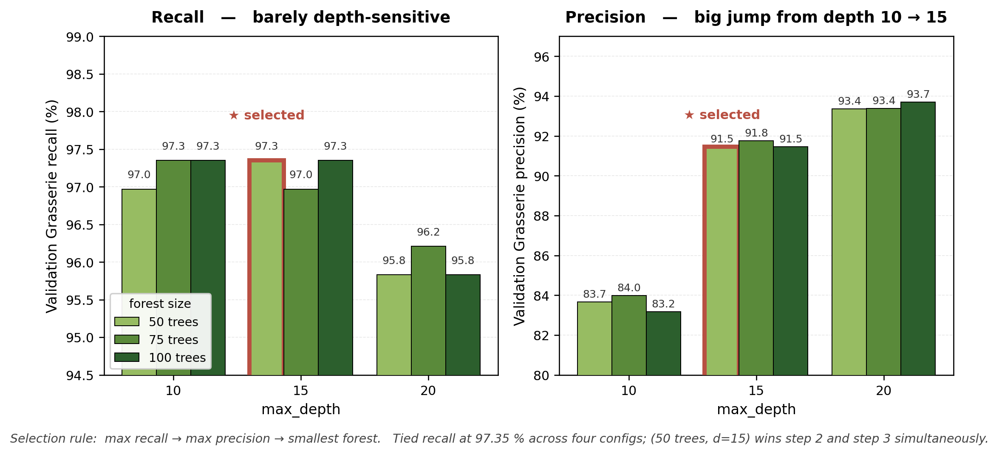
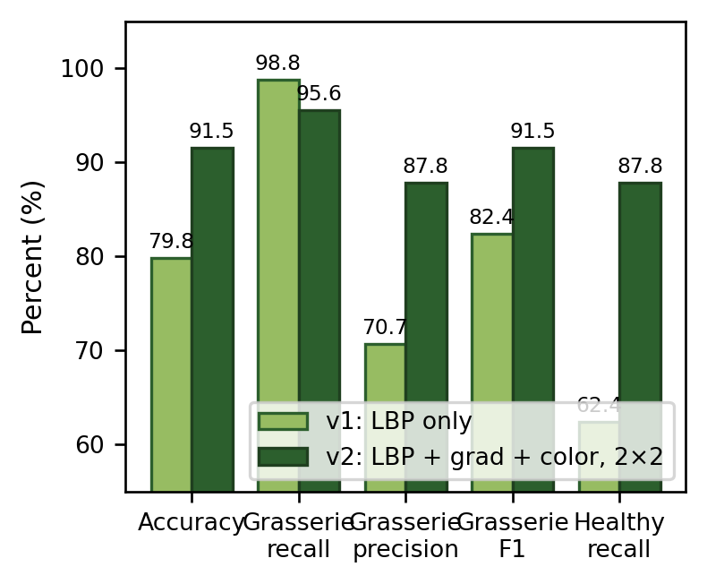
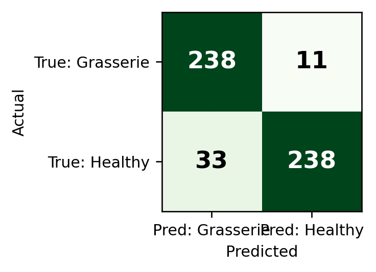

# silkworm-fpga-ml

> Hardware-aware classical machine learning for early **Grasserie disease detection** in silkworms, designed to fit a **PYNQ-Z2 (Xilinx Zynq-7020) FPGA** as a streaming, sub-millisecond screening device.

[](LICENSE)
[](https://www.python.org/)
[]()
[-red.svg)]()
[]()

This repository contains the term-project deliverables for **MYZ307E — Machine Learning for Electrical and Electronics Engineering** (Istanbul Technical University, Spring 2026), and is the software foundation for the senior graduation project, where the same pipeline is to be implemented as hand-written Verilog RTL.

> *Talha Sarıkaya · MYZ307E Term Project · May 2026*

---

## Results at a glance

| Metric (520-sample held-out test set)  | **v1** LBP-only | **v2** Full feature stack | Reference [1] |
| -------------------------------------- | --------------: | ------------------------: | ------------: |
| Test accuracy                          |        79.81 % |              **91.54 %** |       93.16 % |
| Grasserie recall                       |    **98.80 %** |                  95.58 % |       93.38 % |
| Grasserie precision                    |        70.69 % |              **87.82 %** |       91.94 % |
| Disease F1                             |        82.41 % |              **91.54 %** |       92.65 % |
| Feature dimension                      |             10 |                        84 |          many |
| CPU inference / sample                 |        0.053 ms |              **0.027 ms** |             — |
| Preliminary hand-RTL LUT estimate      |          ~10 k |                    ~18 k |             — |

**Bottom line.** v2 essentially matches the reference paper's accuracy (−1.62 pp) and **exceeds** its disease recall by **+2.20 pp**, on a dataset 7.2× larger, using only 84 integer features and 50 small decision trees — small enough to expect a comfortable Zynq-7020 fit (≈34 % of its 53 k LUT budget).

> The comparison to [1] is *suggestive* rather than head-to-head: [1] reports on its own private 1 242-image set, our pipelines on the 8 975-image Roboflow v1 set.

---

## Hyperparameter selection (validation set)



> Recall is almost flat across `max_depth` (95.8–97.4 %). Precision climbs sharply from ≈ 83 % at depth 10 to ≈ 91 % at depth 15 and plateaus near 93 % at depth 20. **Selection rule:** max recall → max precision → smallest forest (LUT-cost tiebreak). Winner: **RF(50 trees, depth 15)** — outlined in red.

## v1 → v2 ablation



v2 is a Pareto improvement over v1 across the screening-relevant metrics, except a 3.2-pp drop in recall (still inside the screening band):

- **Accuracy:** +11.7 pp
- **Disease precision:** +17.1 pp
- **Disease F1:** +9.1 pp
- **Healthy recall:** +25.5 pp
- **Inference time:** roughly halved (trees resolve earlier on richer features)

## Confusion matrix (v2, held-out test)



238 of 249 disease cases caught (only 11 missed); 238 of 271 healthy crops correctly classified (33 false alarms).

---

## The engineering arc — v1 → v2

**v1** is the smallest classical pipeline that fits a Zynq-7020:

- A single 10-bin uniform-LBP histogram (P = 8, R = 1) over a 64×64 grayscale crop,
- fed to a Random Forest trained with `class_weight = {Grasserie: 2.5, Healthy: 1.0}` and a `P(Grasserie) ≥ 0.40` decision rule.
- Reaches **98.80 % Grasserie recall** but only **70.69 % precision** on the held-out test set — too many false alarms.

**v2** keeps v1's training policy and adds three integer feature families on the *same* streaming line-buffer dataflow:

1. **2×2 spatial pooling** — one feature histogram per worm region (head / mid / tail-mid / tail).
2. **8-bin gradient-orientation histogram per cell** — 3×3 Sobel + atan2 quadrant lookup.
3. **Per-cell mean B, G, R** — three accumulators per channel.

Feature dim: 4 cells × (10 LBP + 8 grad + 3 color) = **84 integers per worm**.

Hyperparameter selection follows a transparent 3-step lexicographic rule:

1. Maximise validation Grasserie recall.
2. Among ties, take highest precision.
3. Among remaining ties, take smallest forest (FPGA LUT cost ∝ tree count).

Winner: **RF(50 trees, max_depth = 15)**.

---

## Repository layout

```
silkworm-fpga-ml/
├── README.md                       (this file)
├── LICENSE                         (MIT, code only)
├── CITATION.cff                    (machine-readable citation)
├── CHANGELOG.md
├── requirements.txt
├── .gitignore
│
├── data/
│   └── README.md                   (how to obtain the Roboflow dataset)
│
├── src/                            (ML pipeline)
│   ├── preprocess.py
│   ├── strict_validation_fixed.py  (v1 — audited LBP-only baseline)
│   └── fpga_classical_best.py      (v2 — feature co-design)
│
├── reports/                        (deliverable generators)
│   ├── make_presentation.py        (10-slide PPTX)
│   └── make_report.py              (4-page IEEE DOCX)
│
├── figs/                           (generated figures, used by deliverables and this README)
│   ├── hp_sweep.png                (slide-deck hyperparameter sweep)
│   ├── hp_sweep_report.png         (compact stacked version for the report column)
│   ├── ablation.png                (v1 vs v2 bar chart)
│   ├── cm_v2.png                   (v2 confusion matrix)
│   ├── slide4_crop.png             (BB-crop preprocessing illustration)
│   └── slide6_grid.png             (2×2 spatial pooling illustration)
│
├── docs/                           (final deliverables)
│   ├── silkworm_report.pdf
│   └── silkworm_presentation.pdf
│
└── verilog/                        (senior-project scope)
    └── README.md                   (planned RTL architecture, not yet implemented)
```

---

## How to reproduce

The Roboflow dataset is **not redistributed** in this repository (CC BY 4.0; obtain it from Roboflow — see [`data/README.md`](data/README.md)). Once the dataset is in place:

```bash
# 1) install dependencies
pip install -r requirements.txt

# 2) v1 — minimal LBP-only baseline with recall-first training
python src/strict_validation_fixed.py
#    → expected: test accuracy 79.81 %, Grasserie recall 98.80 %

# 3) v2 — full feature stack (LBP + grad-hist + color, 2×2 pooling)
python src/fpga_classical_best.py
#    → expected: test accuracy 91.54 %, Grasserie recall 95.58 %,
#                Grasserie precision 87.82 %

# 4) regenerate the deliverable artifacts (PDFs + figures)
python reports/make_report.py        # silkworm_report.docx + figs/*
python reports/make_presentation.py  # silkworm_presentation.pptx + figs/*
```

All inference timings reported are measured on a stock laptop CPU through scikit-learn's compiled tree-evaluation path; they serve as a **conservative upper bound** for the eventual hand-RTL FPGA implementation.

---

## Senior-project scope (not yet implemented)

The `verilog/` folder is a placeholder. The intended graduation-project work:

- **Hand-write `random_forest.v`** as a combinational nested-mux array fed by an adder-tree majority vote — no HLS, every module designed by hand in Verilog RTL.
- **Hand-write streaming AXI-Stream IP cores** for the LBP, Sobel-gradient and per-cell color-mean front-ends on top of a 3-row line buffer.
- **Synthesise on PYNQ-Z2** with Vivado, target ≤ 100 µs per crop end-to-end at 150 MHz.
- **Hard-negative mining** to tighten v2's Grasserie precision past 95 %.
- **Extend disease vocabulary** to include Pebrine, Flacherie and Muscardine for full sericulture coverage.

---

## Honest limitations

- **No actual FPGA implementation yet.** All LUT / DSP numbers are pen-and-paper hand-RTL estimates, not post-synthesis figures.
- **No feature-family ablation.** v2 adds spatial pooling, gradient histograms and color simultaneously; the individual contributions have not been isolated.
- **Single random seed.** `random_state = 42` throughout; no bootstrap-style confidence intervals on the reported metrics.
- **Only two classes** (Grasserie vs. Healthy). Pebrine / Flacherie / Muscardine absent.
- **Class-label-direction audit performed and corrected** during validation; all numbers reported come from the corrected pipeline.

---

## Deliverables

- 📄 **Final report (IEEE 4-page):** [`docs/silkworm_report.pdf`](docs/silkworm_report.pdf)
- 🎤 **Presentation (10-slide deck with speaker notes):** [`docs/silkworm_presentation.pdf`](docs/silkworm_presentation.pdf)

---

## Citation

If you use this work, please cite both this repository and the underlying reference paper:

```bibtex
@misc{sarikaya2026silkwormfpgaml,
  author       = {Sar{\i}kaya, Talha},
  title        = {{silkworm-fpga-ml}: Hardware-aware classical ML for
                  silkworm Grasserie detection on PYNQ-Z2},
  year         = {2026},
  howpublished = {MYZ307E term project, Istanbul Technical University},
  url          = {https://github.com/yoctocandela/silkworm-fpga-ml}
}

@article{binson2024silkworm,
  author  = {Binson, V. A. and Manju, G.},
  title   = {Automated Disease Detection in Silkworms Using Machine Learning Techniques},
  journal = {Advance Sustainable Science, Engineering and Technology (ASSET)},
  volume  = {6},
  number  = {4},
  pages   = {02404015},
  year    = {2024},
  doi     = {10.26877/asset.v6i4.965}
}
```

See [`CITATION.cff`](CITATION.cff) for the machine-readable version.

---

## References

1. **Binson V A and Manju G.** *Automated Disease Detection in Silkworms Using Machine Learning Techniques.* Advance Sustainable Science, Engineering and Technology (ASSET), 6(4):02404015, Sept. 2024. DOI: [10.26877/asset.v6i4.965](https://doi.org/10.26877/asset.v6i4.965). *(HOG + Kernel PCA + SVM baseline; 1 242-image private dataset; reported 93.16 % accuracy, 93.38 % recall, 91.94 % precision on Grasserie.)*

2. **Silkworm Annotation.** *Silkworm Diseases — v1.* Roboflow Universe, 2024. <https://universe.roboflow.com/silkworm-annotation-y6ztu/silkworm-diseases-y0bro/dataset/1> *(CC BY 4.0, 8 975 image versions across Grasserie and Healthy classes.)*

3. **H. Z. Hayyan.** *PlantDiseaseDetection — classical HOG/LBP + SVM/Random Forest pipeline for agricultural imagery.* GitHub repository: <https://github.com/haxybaxy/PlantDiseaseDetection>. *(Structural baseline; pipeline architecture adapted to silkworms here.)*

4. **T. Ojala, M. Pietikäinen and T. Mäenpää.** *Multiresolution gray-scale and rotation invariant texture classification with local binary patterns.* IEEE Trans. Pattern Anal. Mach. Intell., 24(7):971–987, 2002.

5. **L. Breiman.** *Random forests.* Mach. Learn., 45(1):5–32, 2001.

6. **N. Dalal and B. Triggs.** *Histograms of oriented gradients for human detection.* In Proc. IEEE CVPR, 886–893, 2005.

7. **Xilinx Inc.** *PYNQ-Z2 board reference manual.* 2018. <https://www.xilinx.com/support/documentation/sw_manuals/xilinx2018_1/ug1209-zynq-pynq-z2.pdf>

---

## License

Code in this repository is released under the **MIT License** (see [`LICENSE`](LICENSE)).

The **Roboflow Silkworm Diseases v1** dataset is released by *Silkworm Annotation* under **CC BY 4.0** and is **not redistributed** in this repository. Please obtain it directly from the link in [`data/README.md`](data/README.md) and credit *Silkworm Annotation* accordingly.

---

## Acknowledgements

Course: **MYZ307E — Machine Learning for Electrical and Electronics Engineering** (Spring 2026), Faculty of Electrical and Electronics Engineering, Istanbul Technical University. Course instructor: Sümeyye Nur Karahan. Dataset: the Silkworm Annotation team on Roboflow Universe. Reference paper: Binson V A and Manju G (ASSET 2024).
